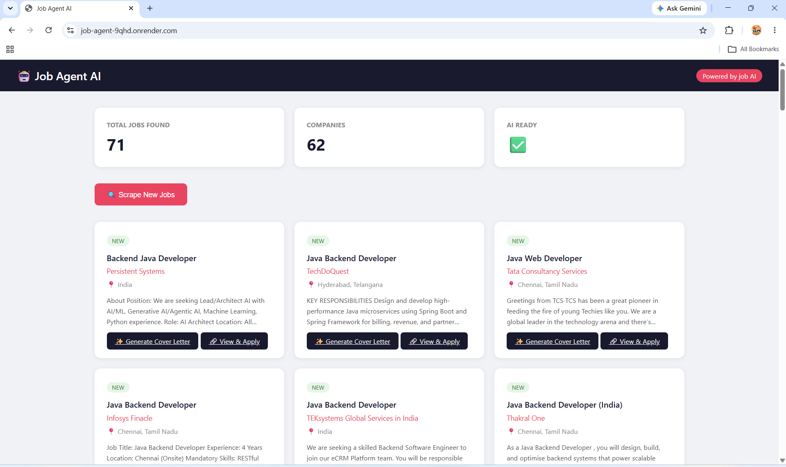
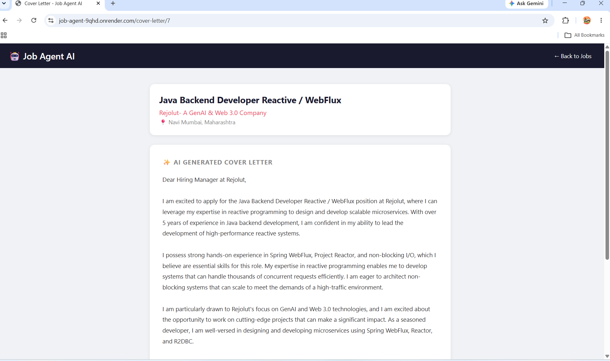

# 🤖 AI Job Agent

An autonomous AI-powered job application agent built with Java and Spring Boot that automatically scrapes job listings, stores them in a database, and generates personalized cover letters using LLM.

## 🚀 Features

- **Autonomous Job Scraping** — Fetches real job listings from Adzuna API across multiple IT domains every hour
- **AI Cover Letter Generation** — Generates personalized cover letters using Groq API (LLaMA 3.3)
- **REST API** — Full CRUD API for job management
- **Dashboard UI** — Clean Thymeleaf-based web interface
- **Scheduled Agent** — Runs automatically every hour without manual intervention
- **Dockerized Database** — PostgreSQL running in Docker via Docker Compose

## 🛠️ Tech Stack

| Layer | Technology |
|-------|-----------|
| Backend | Java 21, Spring Boot 3.5 |
| AI/LLM | Groq API (LLaMA 3.3-70b) |
| Database | PostgreSQL 16 |
| ORM | Spring Data JPA + Hibernate |
| Job Data | Adzuna Jobs API |
| UI | Thymeleaf |
| DevOps | Docker, Docker Compose |
| Build | Maven |

## 📋 Prerequisites

- Java 21+
- Docker Desktop
- Groq API Key (free at console.groq.com)
- Adzuna API Key (free at developer.adzuna.com)

## ⚙️ Setup & Run

**1. Clone the repository**
```bash
git clone https://github.com/sikharsethi/job-agent.git
cd job-agent
```

**2. Configure environment**
```bash
cp src/main/resources/application.example.properties src/main/resources/application.properties
```
Fill in your API keys in `application.properties`

**3. Start the database**
```bash
docker-compose up -d
```

**4. Run the application**
```bash
./mvnw spring-boot:run
```

**5. Open in browser**

http://localhost:8080

## 🔌 API Endpoints

| Method | Endpoint | Description |
|--------|----------|-------------|
| GET | `/api/jobs` | Get all jobs |
| POST | `/api/jobs` | Add a job manually |
| GET | `/api/jobs/{id}/cover-letter` | Generate AI cover letter |
| POST | `/api/jobs/scrape` | Trigger manual scrape |

## 🏗️ Architecture

┌─────────────────────────────────────────┐

│           Thymeleaf Dashboard           │

└──────────────────┬──────────────────────┘

│

┌──────────────────▼──────────────────────┐

│         DashboardController             │

│           JobController                 │

└──────┬───────────────────────┬──────────┘

│                       │

┌──────▼──────┐    ┌──────────▼─────────┐

│  JobService │    │   ScraperService   │

│  GroqService│    │   (Scheduled/1hr)  │

└──────┬──────┘    └──────────┬─────────┘

│                       │

┌──────▼──────┐    ┌──────────▼─────────┐

│ JobRepository│   │    Adzuna API      │

│ (PostgreSQL) │   │    Groq API        │

└─────────────┘    └────────────────────┘

## 📸 Screenshots

### Dashboard


### AI-Generated Cover Letter


## 🤝 Author

**Sikhar Sethi**  
[GitHub](https://github.com/sikharsethi)
